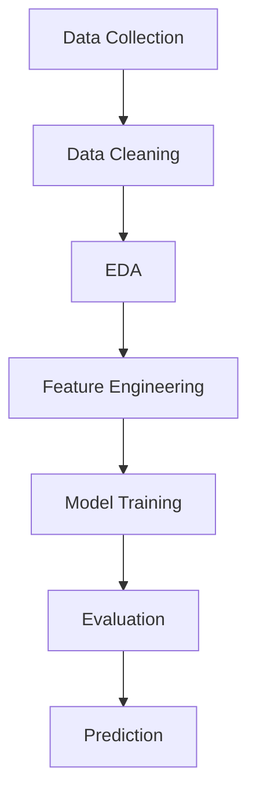

#  Car Price Prediction


---

##  Overview

This project builds a **machine learning regression model** to predict used car prices based on historical and technical attributes. It helps users make **data-driven pricing decisions** with high accuracy.

---

##  Problem Statement

Used car pricing is often inconsistent and subjective.
This project solves that by creating a **predictive model** that estimates fair market value using real data.

---

##  Dataset Summary

| Feature       | Description               |
| ------------- | ------------------------- |
| Year          | Manufacturing year        |
| Present_Price | Current price (in lakhs)  |
| Kms_Driven    | Distance covered          |
| Fuel_Type     | Petrol / Diesel / CNG     |
| Seller_Type   | Dealer / Individual       |
| Transmission  | Manual / Automatic        |
| Owner         | Number of previous owners |

---

##  Tech Stack

* **Language:** Python 
* **Libraries:** Pandas, NumPy, Matplotlib, Seaborn
* **ML Framework:** Scikit-learn

---

##  Workflow



---

##  Models Implemented

| Model             | Performance |
| ----------------- | ----------- |
| Linear Regression | Moderate    |
| Decision Tree     | Good        |
| Random Forest     |  Best      |

---

##  Results

* **Best Model:** Random Forest
* **R² Score:** ~0.90+
* **Key Insight:**

  * Car age and present price strongly influence resale value
  * Random Forest handles complex relationships better

---

## Sample Prediction

| Input Features        | Predicted Price   |
| --------------------- | ----------------- |
| 5-year-old Petrol Car | ₹4.5 – ₹5.2 Lakhs |

---

##  How to Run

```bash
# Clone repository
git clone https://github.com/your-username/car-price-prediction.git

# Navigate
cd car-price-prediction

# Install dependencies
pip install -r requirements.txt

# Run notebook
jupyter notebook Car_Price_Prediction.ipynb
```

---

##  Future Enhancements

* Hyperparameter tuning for higher accuracy
* Deployment using **Streamlit / Flask**
* Integration with live car market APIs
* Adding deep learning models

---

##  Key Highlights

1. Clean and structured ML pipeline
2. Strong predictive performance (90%+ accuracy)
3. Real-world applicability


---

##  Author

**Siddharth Singh**
